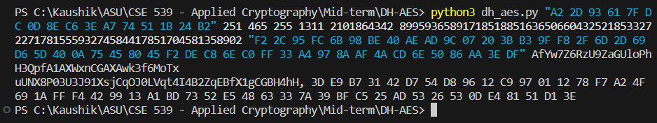
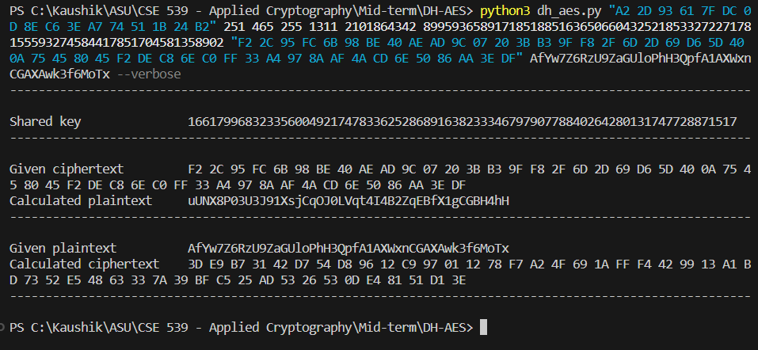

# Diffie-Hellman and AES encryption

## Setup and requirements

- Recommended Python version: 3.10.5 or later
- Install packages from requirements.txt

## Run program

The specified example's inputs:

```shell
python3 dh_aes.py "A2 2D 93 61 7F DC 0D 8E C6 3E A7 74 51 1B 24 B2" 251 465 255 1311 2101864342 8995936589171851885163650660432521853327227178155593274584417851704581358902 "F2 2C 95 FC 6B 98 BE 40 AE AD 9C 07 20 3B B3 9F F8 2F 6D 2D 69 D6 5D 40 0A 75 45 80 45 F2 DE C8 6E C0 FF 33 A4 97 8A AF 4A CD 6E 50 86 AA 3E DF" AfYw7Z6RzU9ZaGUloPhH3QpfA1AXWxnCGAXAwk3f6MoTx
```

This gives the attached outputs:


For a more verbose output, include the `--verbose` flag:

```shell
python3 dh_aes.py "A2 2D 93 61 7F DC 0D 8E C6 3E A7 74 51 1B 24 B2" 251 465 255 1311 2101864342 8995936589171851885163650660432521853327227178155593274584417851704581358902 "F2 2C 95 FC 6B 98 BE 40 AE AD 9C 07 20 3B B3 9F F8 2F 6D 2D 69 D6 5D 40 0A 75 45 80 45 F2 DE C8 6E C0 FF 33 A4 97 8A AF 4A CD 6E 50 86 AA 3E DF" AfYw7Z6RzU9ZaGUloPhH3QpfA1AXWxnCGAXAwk3f6MoTx --verbose
```



### Notes and inferences

- Recent versions (2.2+) of Python automatically handle large numbers
- Little-endian vs big-endian: given inputs are little-endian byte arrays, so when converting keys from integers to bytes, we convert to little-endian byte order
- `cryptography` package is used here for AES - `pip install cryptography`
- Used AES-256 algorithm - CBC mode of operation, using provided initialization vector (IV is commonly prepended to ciphertext in practice)
- [Library reference for implementation](https://cryptography.io/en/latest/hazmat/primitives/symmetric-encryption/#cryptography.hazmat.primitives.ciphers.Cipher)
