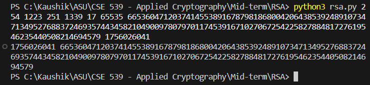
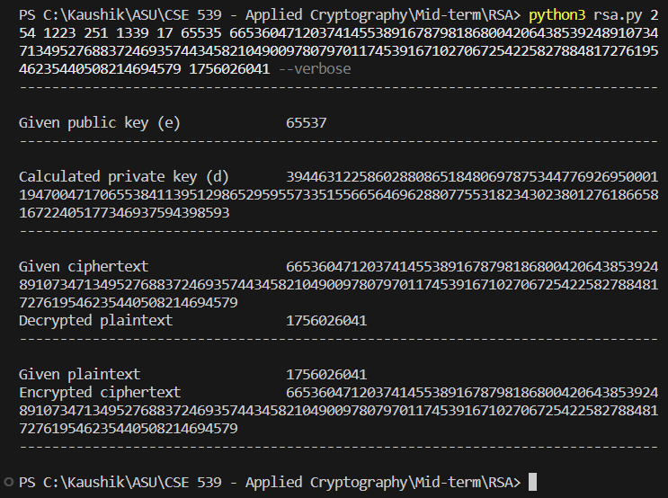

# RSA encryption

## Setup and requirements

- Minimum required Python version: 3.3
- No additional dependencies

## Run program

The specified example's inputs:

```shell
python3 rsa.py 254 1223 251 1339 17 65535 66536047120374145538916787981868004206438539248910734713495276883724693574434582104900978079701174539167102706725422582788481727619546235440508214694579 1756026041
```

This gives the attached outputs:


For a more verbose output, include the `--verbose` flag:

```shell
python3 rsa.py 254 1223 251 1339 17 65535 66536047120374145538916787981868004206438539248910734713495276883724693574434582104900978079701174539167102706725422582788481727619546235440508214694579 1756026041 --verbose
```



### Notes and inferences

- Recent versions (2.2+) of Python automatically handle large numbers
- In this implementation, Euler totient function is used, and not Carmichael totient function
